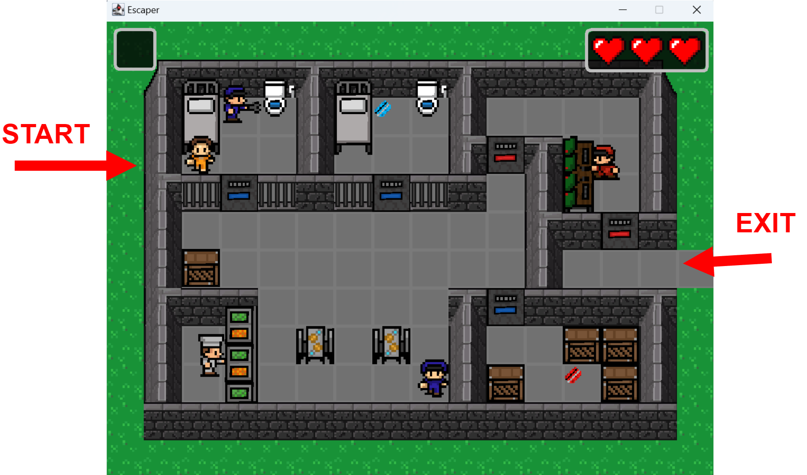

# Escaper
In Escape, you play as a prisoner trying to escape a high-security prison in a retro 2D pixelated world. Navigate through locked doors using keycards and fight off guards as you make your daring escape.

# Takeaways 
My first java project. A 2d game made for Prog3 lab(java course). As for first project in java, and at that time i was satisfied with it, but looking back of course it's not well designed and mainly copied a tutorial. It is a good example(at least for me) of what could have been done better, what were the main issues, so here are the takeaways and notes after reviewing:

+ Well described and documented. (could be better, but at that time good)
+ Extra work, and not being satisfied with bare minimum, made this small project much better. (at least visually, and in a "game sense")
  
- Design patterns over "Manager class". In this project the manager class handles or operates almost everything, which is very hard to read and understand. (that time haven't learned about any design patterns yet) I would choose a better scalable approach next time.
- Lacks layer separation. Would be much easier to understand, if the visual/sound would be separated from the logic.(cluttered/messy code)
- Duplicated code in subclasses. (need better design)
- Don't follow tutorial blindly. At the time the lack of knowledge and coming deadlines made me choose to follow a tutorial, which was a good choice of getting the job done, but for learning not so much. A not so great(low expectation) project would have been more beneficial for the purpose of getting better.
